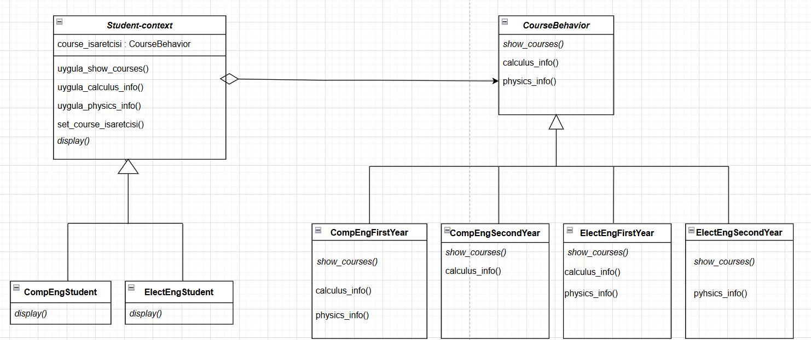

# MÜhendislik Fakültesi Öğrenci ve Ders Sistemi

## Design Pattern: Strategy
` Student sınıfı context rolünde.
` course_isaretcisi üzerinden CourseBehavior davranışlarını çalıştırıyor.
` COurseBehavior sınıfı strategy interface'i.
` show_courses() abstract method, bölüm ve sınıflarda farklılık göstererek override ediliyor.
` mühendislik fakültelerindeki bazı ortak dersler calculus_info() ve physics_info(), her sınıfta alınmak zorunda olunmadığı için abstract değil.

### UML Diyagramı

