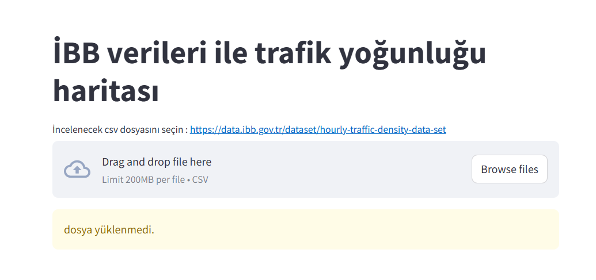
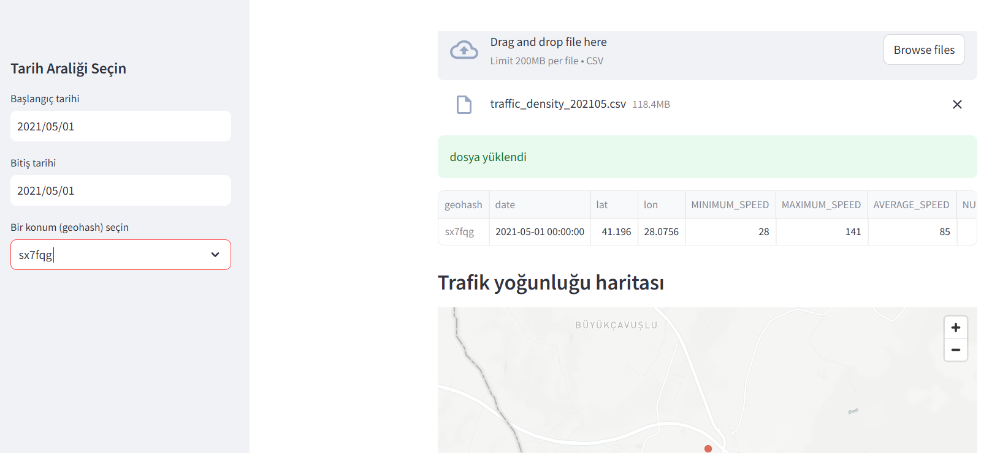

# Trafik Yoğunluğu Haritası Uygulaması
Bu proje, İstanbul Büyükşehir Belediyesi (İBB) tarafından sağlanan trafik yoğunluğu verilerini görselleştiren bir **Streamlit** uygulamasıdır. 
https://data.ibb.gov.tr/tr/dataset/hourly-traffic-density-data-set

## Özellikler
- Tarih aralığına göre trafik verilerini filtreleme
- Konum (geohash) seçerek trafik yoğunluğunu inceleme
- Seçilen veriyi CSV formatında indirme
- İstanbul'daki trafik yoğunluğunu görsel olarak harita üzerinde görüntüleme

## Gereksinimler
- `pandas`
- `numpy`
- `streamlit`

## Sayfa Görünüşü




## Uygulama
```bash
pip stremalit run traffic_mapping.py
